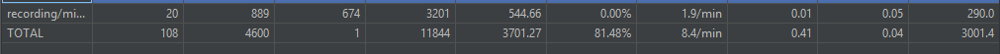

# Maxima en Android

Maxima, un sistema de álgebra computacional con todas las funciones, ahora se ejecuta en sus dispositivos móviles Android. Maxima, y su predecesor Macsyma es uno de los software más antiguos del mundo, en la década de 1960 en el MIT LCS y Project Mac. Puede realizar muchas operaciones matemáticas como integración, diferenciación, operaciones matriciales, números racionales, tratamiento simbólico de constantes como pi, e, gamma de Euler, tratamiento simbólico y numérico de funciones especiales como sin(x), cos(x), log(x), exp(x), zeta(s), y muchos más.
Maxima en Android es un puerto de Maxima en el sistema operativo
Android. Gracias al esfuerzo de Sylvain Ageneau en la migración de Embeddable Common Lisp al sistema operativo Android, el último código Maxima se ejecuta muy bien en ECL en Android con cambios muy pequeños en el código fuente.
Maxima en Android es una combinación de muchos programas de código abierto: ECL en Android, MathJax y el propio Maxima.
Escribí aproximadamente mil líneas de código Java y cien líneas de HTML incluyendo código Javascript.
La instalación del software requiere un total de 90 MB en el
almacenamiento. Es necesario instalar 30 MB en el almacenamiento interno. El resto de 60 MB se pueden instalar en el almacenamiento externo o interno. La primera ejecución del apk te preguntará dónde quieres que se instalen los 60MB.
A continuación, puede disfrutar de Maxima / Macsyma en su teléfono móvil o tableta basada en el sistema operativo
Android.

# Distribucion de Codigo fuente de Maxima on Android
written by Yasuaki Honda (yasuaki.honda@gmail.com)

Copyright 2012,2013,2014,2015,2016,2017,2018,2019 Yasuaki Honda, Chiba, Japan

Development Environment of the author:
- iMac with Mac OS 10.15
- Android Studio 3.1.4
- Up to date Android SDK
- Android NDK r12

All the compiled binaries for maxima, gnuplot, and qepcad for ARM are
included in the asset folder.

This repository is provided in the hope that anyone can easily start the development of 
Maxima on Android using Google's Android Studio.

License
You can find all the license terms in the assets-About_MoA-index.html file. Here is a
copy of the same language:

Maxima on Android
Copyright 2012, 2013, 2014, 2015, 2016, 2017, 2018, 2019 Yasuaki Honda (yasuaki.honda@gmail.com)
    MaximaOnAndroid is a combination of many open source software. 
    All such open source software are governed by their own license terms.
    They appear in other sections of this document. 
    The following license is applicable to the Java and HTML source codes 
    solely written by the author of MaximaOnAndroid.
    This file is part of MaximaOnAndroid.

    MaximaOnAndroid is free software: you can redistribute it and/or modify
    it under the terms of the GNU General Public License as published by
    the Free Software Foundation, either version 2 of the License, or
    (at your option) any later version.

    MaximaOnAndroid is distributed in the hope that it will be useful,
    but WITHOUT ANY WARRANTY; without even the implied warranty of
    MERCHANTABILITY or FITNESS FOR A PARTICULAR PURPOSE.  See the
    GNU General Public License for more details.

    You should have received a copy of the GNU General Public License
    along with MaximaOnAndroid.  If not, see http://www.gnu.org/licenses/.

# Reporte de Pruebas
# Pruebas Funcionales
## Herramientas:
### Junit
JUnit es el estándar de facto para las pruebas unitarias de una aplicación Java. Aunque, es popular para las pruebas unitarias, tiene soporte completo y provisión para pruebas de instrumentación también. La biblioteca de pruebas de Espresso amplía las clases JUnit necesarias para admitir las pruebas de instrumentación basadas en Android
En este caso se uso las etiquetas siguientes:

- @Test: Cuando un metodo en particular posea una etiqueta superior quiere indicar que se considera como un caso de pruebas y sera ejecutado por JUnit Runner
- @Rule: El framework de pruebas de Android proporciona una regla, ActivityTestRule, para iniciar una activity de Android antes de ejecutar los casos de prueba. Inicia la actividad antes de cada método anotado con @Test' y @Before. Finalizará la actividad después del método anotado con @After. Un código de ejemplo es el siguiente.
- @RunWith(AndroidJUnit4.class): Tambien proporcionamos una etiqueta que indica que version de Junit se usara en nuestro caso JUnit4
- 
### Espresso
Espresso es un framework pruebas de interfaz de usuario (UI) android de código abierto desarrollado por Google. El termino espresso significa Café. Espresso es un framework de pruebas simple, eficiente y flexible.

### Características de Espresso
- Algunas de las características más destacadas compatibles con Espresso son las siguientes:
- API muy simple y por lo tanto, fácil de aprender.
- Altamente escalable y flexible.
- Proporciona un módulo independiente para probar el componente Android WebView.
- Proporciona un módulo independiente para validar y simular los intentos de Android.
- Proporciona sincronización automática entre la aplicación y las pruebas.
### Instalacion Simple
De forma predeterminada, Android studio establece el marco de pruebas de espresso (biblioteca de soporte de Android) como una dependencia mientras crea el proyecto android y gradle descargará la biblioteca necesaria desde el repositorio de Maven.

- Inicie Android Studio.
- Seleccione Archivo → Nuevo → Nuevo proyecto.
- Escriba Nombre de la aplicación.
- Y finalemente instancia el framework en el archivo gradle

## Archivos del proyecto (los test se encuentran en la carpeta (Maxima-on-Android-AS\app\src\androidTest\java\jp\yhonda)

## Imagen de Reportes

## Resultados de la terminal

## Reporte en formato excel
https://docs.google.com/spreadsheets/d/1e6RjyvkgYpCDrmIeGkS9Zhxr4Zg8tzOzXudyMxulx20/edit?usp=sharing

## Reporte en formato pdf
https://github.com/kpzaolod6000/Maxima-on-Android-AS/blob/main/Casos%20de%20prueba%20IS%20III%20-%20Hoja%201.pdf

# Pruebas de Seguridad

## Herramienta 
Mobile Security Framework (MobSF) es un Framework de pen-testing de aplicaciones móviles todo en uno automatizado, de código abierto (Android / iOS / Windows) capaz de realizar análisis estáticos, dinámicos y de malware. OWASP MSTG lo sugiere para el análisis estático de seguridad en aplicaciones móviles. Se puede utilizar para un análisis de seguridad rápido y eficaz de aplicaciones móviles de Android, iOS y Windows y admite tanto binarios (APK, IPA y APPX) como código fuente comprimido. MobSF puede realizar pruebas de aplicaciones dinámicas en tiempo de ejecución para aplicaciones de Android y tiene capacidades de fuzzing de API web impulsadas por CapFuzz, un escáner de seguridad específico de API web.

## Análisis Estático

### Resumen General

- Certificate Information

    

    

- Application Permissions

    

- APKID analysis APKID le brinda información sobre cómo se hizo un APK. Identifica muchos compiladores, empaquetadores, ofuscadores y otros weird stuffs. 
    

- Manifest Analysis

    

- Code Analysis

    

    

- NIAP Analysis La certificación NIAP proviene de la National Information Assurance Partnership, que supervisa las pruebas de seguridad, la evaluación y la validación de los productos y sistemas informáticos, incluidos los que se utilizan en los sistemas de seguridad nacionales. 

    

- Hardcode Secrets

    

## Análisis Dinámico

- TLS/SSL Security Tester

    

- Domain Malware Check

    

- Trackers

    

# Prueba de Rendimiento

## JMETER
JMeter es un proyecto de Apache que puede ser utilizado como una herramienta de prueba de carga para analizar y medir el rendimiento de una variedad de servicios, con énfasis en aplicaciones web.

## Pasos

-Se debre grear el Thread Group. 
-Dentro del Thread Group de agraga el recording controller, ya que usaremos una app de celular. 
-Dentro del Thread Group de agraga el View Reult tree para ver los resultados de las instrucciones. 
-Dentro del Thread Group de agraga el timer constante para darle un tiempo de espera. 
-En el Test Plan se Agrega un HTTP(S) The Scrip Recorder para grabar. 
-En el Test Plan Se agrega un reporte de resumen(Summary Report). 

La estructura queda de la suguiente forma: 

  
    

## Resultados 
Los resultados siguiente estan hechos con Recording Controlle

1)En el view Result Tree vemos los resultados del sample results 

   

2) Aqui se muestra los resultados del resumen reporte 

    

